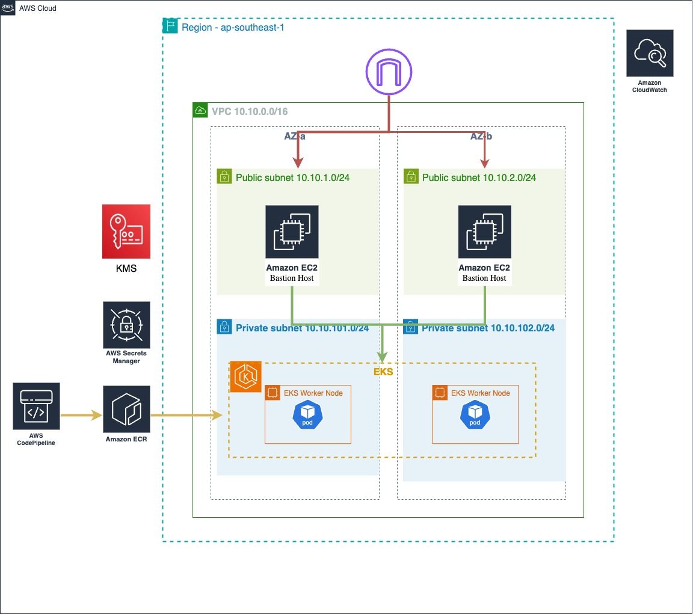

# asiayo-sre-test
Solutions for AsiaYo Site Reliability Engineer Test

## **question 2: terraform Infrastructure and Kubernetes **

### **Terraform 架構說明**
#### VPC
- 建立基礎的 VPC 網路環境，包括 Public 和 Private Subnets。
- Public Subnet 使用 IGW (Internet Gateway) 進行外部連線。
- Private Subnet 使用 NAT Gateway 對外連接。
- 多 AZ 設計實現高可用性，確保網路穩定。

#### EC2 :
- 在 Public Subnet 中建立一台 EC2 Instance 作為跳板機 (Bastion Host)。

#### EKS：
- 建立 AWS Elastic Kubernetes Service (EKS) Cluster。
- 配置 Node Group 和相關的 IAM Roles。
- 高可用性部署

### **架構圖**

### **Kubernetes 說明**
以下為 Kubernetes 的資源與配置檔說明：
- 00-namespace.yaml (定義 asiayo namespace，實現資源隔離。)
- 01-pv.yaml (提供MySQL 持久化存儲)
- 02-pvc.yaml (向PV請求空間)
- 03-Secret.yaml (存儲 MySQL敏感訊息)
- 04-mysql.yaml（StatefulSet) 部署 MySQL
- 05.service.yaml（MySQL 的 Service）
- 06-Deployment.yaml（nginx Deployment + 定義 ClusterIP Service，內部通訊負載均衡)
- 07-ingress.yaml（ Ingress 將外部流量通過域名 `asiayo.com` 路由至服務）

### 補充說明
考量High Availability，EKS 和 VPC 皆使用多 AZ 設置
Terraform 與 Kubernetes 配置檔都有加上註解，方便面試官快速了解。

## 情境實戰測驗

檔名是scenario-questions.md